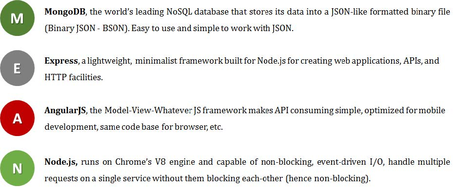
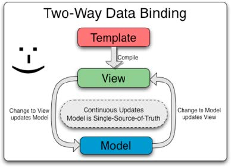
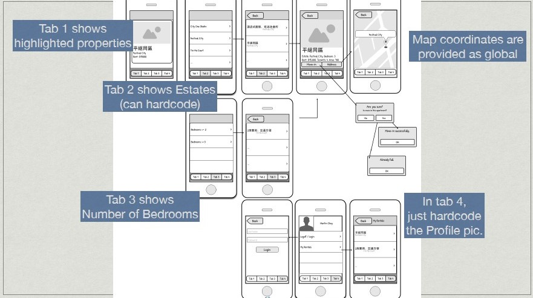

# MiniProject-mobile-app

## MEAN Stack

- Node.js is Asynchronous: Node.js is good for IO heavy apps.
- Vue.js is very similar to AngularJS: As this course is centered around JavaScript, we will cover Vue.js.

## Hybrid Web

Hybrid Web Apps are Web apps that are packaged in a custom full-screen browser to resemble a native mobile app, with extensions that provide access to some hardware features, but your user interface is still written in HTML/CSS and rendered by a web browser

#### NativeScript
- Supports cross-platform development
- Native: XML and JavaScript are translated into native iOS and Android languages.
- Supports a range of languages and front-end frameworks


## Vue.js
 >Vue.js is built on the belief that declarative programming should be used to create user interfaces and connect software components, while imperative programming is better suited to defining an application's business logic.
Thus, a set of useful directives are provided to support the declarative programming. These directives includes ```v-for```, ```v-model``` and ```v-on:click``` etc ...
In this course, we will introduce Vue.js. It will be used in both web and mobile application development. The official website of Vue.js is https://vuejs.org.
>- Vuetify.js (https://vuetifyjs.com/en/)
>- Vue Material (https://vuematerial.io)
>- Many more: https://blog.bitsrc.io/11-vue-js-component-libraries-you-should-knowin-2018-3d35ad0ae37f

### Directives
> At a high level, directives are markers on a DOM element that tell Vue's HTML compiler to attach a specified behavior to that DOM element, or even to transform the DOM element and its children.
>Vue.js comes with a set of these directives built-in, like v-for, vmodel,and v-on:click, etc…

#### v-for
- The v-for directive instantiates a template once per item from a collection.
```js
<v-card max-width="344" class="mx-auto" v-for="event in events">
<v-list-item>
    <v-list-item-avatar color="grey"></v-list-item-avatar>
        <v-list-item-content>
            <v-list-item-title class="headline">{{event.name}}</v-list-item-title>
            <v-list-item-subtitle>by Kurt Wagner</v-list-item-subtitle>
        </v-list-item-content>
</v-list-item>
--------------------
<v-img :src=event.image height="194"></v-img>
<v-card-text>
    {{event.fullDes}}.
</v-card-text>
--------------------
data: {
events: [
{
name: "Keynote Speech",
fullDes: "Keynote speakers image: "http://sosc.hkbu.edu.id: 1,
```

#### v-model
- The v-model directive binds an input, select, text-field (or custom form control) to a property in the data object.

```js
 <v-text-field
label="Regular" v-model="message"
></v-text-field>
--------------------
data: {
message: "default message",
}
```


#### v-on:click
- The v-on:click directive allows you to specify custom behavior
when an element is clicked
```js
<v-btn icon v-on:click="like">
    <v-icon>mdi-heart</v-icon>
</v-btn>
--------------------
methods: {
    like: function(event) {
    event.target.style.color = "red";
    },
},
```
#### Major Items in Vue.js
 - Mounted: Execute after all reactive components are rendered
    ```js
    mounted: async function() {
    var response = await fetch("https://api.myjson.com/bins…
    ```
    

 - Methods: Develop call-back functions like v-on:click
   ```js
   like: function(event) {
   ```
 - Data: Allow two-way binded data (with v-model).
    ```js
    data: {
        message: "default message",
        }
    ```
### Other
- Ajax Request with Fetch API
```js
async mounted() {
    global.rootURL = "https://api.myjson.com";
    var response = await fetch(global.rootURL + "/bins/fgrmm", {
        method: "GET",
        credentials: "same-origin"
        });
    if (response.ok) {
            this.feeds = await response.json();
            console.log(JSON.stringify(this.feeds));
        } else {
            console.log(response.statusText);
    }
}
---------------
data: {
feeds: [],
}
```

## Mobile App

- Contains:
  - Array Filtering in JavaScript
  - Transit to another page
  - Receiving End and Delegate
  - Dialogs

- Loacal installation
  1. ```npm install -g nativescript@latest```
  2. ```npm install -g conventional-changelog-cli```
  3. ```tns preview```
  4. modify app/app.css adding  ``` @import '~nativescript-theme-core/css/core.light.css';```


## Doing
#### HomePage

#### Estate Search

#### Bedroom Search

#### DetailPage

#### ApartmentAddress

#### Login
